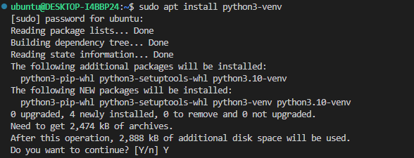
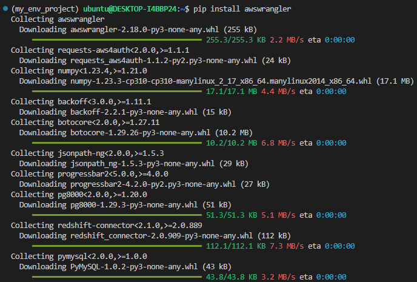
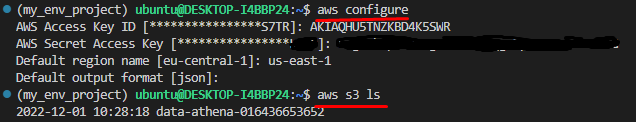
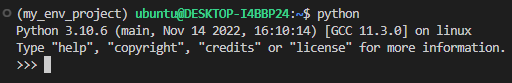
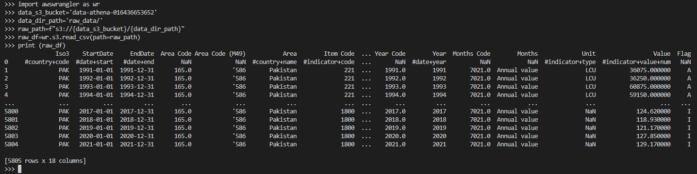
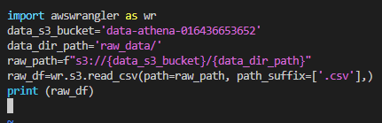
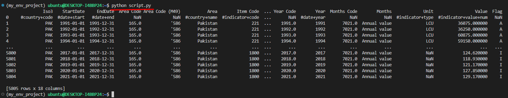
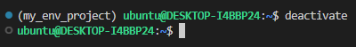

# AWS_SDK_for_Pandas_(awswrangler_or_datawrangler)_Overview

## Description
This is an overview of the AWS SDK for pandas (awswrangler) which is an open-source python library that makes it easier to work with data from AWS services.

## Overview
[AWS Data Wrangler](https://aws-sdk-pandas.readthedocs.io/en/stable/index.html) is an open-source Python library built on top of [Pandas](https://github.com/pandas-dev/pandas), [Apache Arrow](https://github.com/apache/arrow), and [Boto3](https://github.com/boto/boto3), it offers abstracted functions to execute usual ETL tasks like loading/unloading data from Data Lakes, Data Warehouses, and Databases using python.
AWS [datawrangler](https://aws-sdk-pandas.readthedocs.io/en/stable/index.html#) is easily integrated with AWS services like [AWS S3, AWS Glue, Amazon Athena](https://github.com/masood2iq/AWS_Athena_Glue_S3_CloudFormation_Deployment_AWSConsole), AWS DynamoDB, AWS CloudWatch, AWS Redshift, Amazon Timestream, AWS EMR, etc.
Working with data datawrangler support reading and writing Excel, JSON, CSV, and Parquet from S3. Interact with data and metadata through AWS Glue and run SQL queries on Amazon Athena.

**Note:** Before working with AWS [datawrangler](https://aws-sdk-pandas.readthedocs.io/en/stable/index.html) you need to install and configure your [AWS CLI](https://docs.aws.amazon.com/cli/latest/userguide/getting-started-install.html) account on your Linux machine.

Now, before installing **[datawrangler](https://aws-sdk-pandas.readthedocs.io/en/stable/index.html)**, we need to install the **python3** on our Linux machine, which can be done with commands

```sh
$ apt update
```  

```sh
$ apt install -y python3
```

After installation of **python3**, we need to install the python package **pip**, which can be done with commands

```sh
$ apt install python3-pip
```

```sh
$ pip3 install --upgrade pip
```

```sh
$ apt install -y python3-venv
```



# To create a virtual environment for python 3, we can do it in two ways as

### <u>**WAY - 1**</u>
Create a virtual environment, which can be done with commands.

```sh
$ python3 -m venv my_env_project
```


The above command creates a directory named `my_env_project` in the current directory, which contains pip, interpreter, scripts, and libraries, view as

```sh
$ ls my_env_project/
```


You can now `activate the virtual environment`, with the command

```sh
$ source my_env_project/bin/activate
```


Command prompt would change to your environment and will look as shown

```sh
(my_env_project) ubuntu@DESKTOP-I4BBP24:~$
```


Now, we install the `awswrangler` package into our `virtual environment` as

```sh
(my_env_project)$ pip install awswrangler
```



Now, if you didn’t configured AWS CLI, configure as

```sh
(my_env_project)$ aws configure
```



Run python command inside `virtual environment` to open the interpreter

```sh
(my_env_project)$ python
```



Every time you install a new package inside your `virtual environment`, you should be able to import it into your project.
Now let’s test `awswrangler` with `S3 bucket`.

```sh
(my_env_project) ubuntu@DESKTOP-I4BBP24:~/my_env_project$ python
>>> import awswrangler as wr
>>> s3_bucket_name='you_bucket_name'
>>> s3_bucket_file_path='directory_name/'
>>> s3_bucket_path=f"s3://{s3_bucket_name}/{s3_bucket_file_path}"
>>> df=wr.s3.read_csv (path=s3_bucket_path, path_suffix=['.csv'])
>>> print (df)
```



To exit from the interpreter, type

```sh
>>> quit()
```

We can also create a python script and run from inside python 3 `virtual environment` as

```sh
(my_env_project) ubuntu@ubuntu:~$ vim script.py
```

Copy and paste the given code inside the script file

```
import awswrangler as wr
s3_bucket_name='you_bucket_name'
s3_bucket_file_path='directory_name/'
s3_bucket_path=f"s3://{s3_bucket_name}/{s3_bucket_file_path}"
df=wr.s3.read_csv (path=s3_bucket_path, path_suffix=['.csv'])
print (df)
```



To execute the script, run command

```sh
(my_env_project) ubuntu@ubuntu:~$ python script.py
```



To exit from `virtual environment` use `exit` or `Ctrl+d` command. To delete a `virtual environment` run the following command

```sh
(my_env_project) ubuntu@ubuntu:~$ deactivate
```



The above command won't remove `my_env_project` directory, simply use `rm` command to delete it.

### <u>**WAY - 2**</u>
Create a directory and go into it to create virtual environment as


mkdir jupyter_notebook

ls jupyter_notebook

cd jupyter_notebook


Now, create a python virtual environment named "jup_notebook"

---------------------------------------------------------------

virtualenv jupyter_notebook


To activate and get inside that virtual environment

-----------------------------------------------------

source jupyter_notebook/bin/activate


install Jupyter inside the virtual environment

-----------------------------------------------

pip3 install jupyter


create a kernel that can be used to run python commands inside the virtual environment of jupyter notebook

-----------------------------------------------------------------------------------------------------

ipython kernel install --user --name=python-env


you can launch its web interface from the terminal

---------------------------------------------------

jupyter notebook --allow-root


you get the link to open in your browser


 

Click on new drop down and select your environment

 


Install awswrangler with command

pip install awswrangler


Run the code

import awswrangler as wr

raw_s3_bucket = 'athena-demo-test-bucket'

raw_path_dir = 'Food-Prices-2022/'

raw_path = f"s3://{raw_s3_bucket}/{raw_path_dir}"

raw_df = wr.s3.read_csv(path=raw_path, path_suffix=['.csv'],)

print (raw_df)


After you are done with the project and no longer need the kernel you can uninstall

------------------------------------------------------------------------------------

jupyter-kernelspec uninstall python-env

 


To exit from virtual env

--------------------------

deactivate


To delete the virtual environment

-----------------------------------

virtualenv --clear /home/ubuntu/jupyter-notebook/
