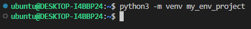

# AWS_SDK_for_Pandas_(awswrangler_or_datawrangler)_Overview

## Description
This is an overview of the AWS SDK for pandas (awswrangler) which is an open-source python library that makes it easier to work with data from AWS services.

## Overview
[AWS Data Wrangler](https://aws-sdk-pandas.readthedocs.io/en/stable/index.html) is an open-source Python library built on top of [Pandas](https://github.com/pandas-dev/pandas), [Apache Arrow](https://github.com/apache/arrow), and [Boto3](https://github.com/boto/boto3), it offers abstracted functions to execute usual ETL tasks like loading/unloading data from Data Lakes, Data Warehouses, and Databases using python.
AWS [datawrangler](https://aws-sdk-pandas.readthedocs.io/en/stable/index.html#) is easily integrated with AWS services like [AWS S3, AWS Glue, Amazon Athena](https://github.com/masood2iq/AWS_Athena_Glue_S3_CloudFormation_Deployment_AWSConsole), AWS DynamoDB, AWS CloudWatch, AWS Redshift, Amazon Timestream, AWS EMR, etc.
Working with data datawrangler support reading and writing Excel, JSON, CSV, and Parquet from S3. Interact with data and metadata through AWS Glue and run SQL queries on Amazon Athena.

**Note:** Before working with AWS [datawrangler](https://aws-sdk-pandas.readthedocs.io/en/stable/index.html) you need to install and configure your [AWS CLI](https://docs.aws.amazon.com/cli/latest/userguide/getting-started-install.html) account on your Linux machine.

Now, before installing **[datawrangler](https://aws-sdk-pandas.readthedocs.io/en/stable/index.html)**, we need to install the **python3** on our Linux machine, which can be done with commands

``` sh
$ apt update
```  

``` sh
$ apt install -y python3
```

After installation of **python3**, we need to install the python package **pip**, which can be done with commands

``` sh
$ apt install python3-pip
```

``` sh
$ pip3 install --upgrade pip
```

``` sh
$ apt install -y python3-venv
```


  
# To create a virtual environment for python 3, we can do it in two ways as
  
----
### <u>**WAY - 1**</u>
----
Create a virtual environment, which can be done with commands.

``` sh
$ python3 -m venv my_env_project
```




The above command creates a directory named `my_env_project` in the current directory, which contains pip, interpreter, scripts, and libraries, view as

``` sh
$ ls my_env_project/
```


You can now `activate the virtual environment`, with the command

``` sh
$ source my_env_project/bin/activate
```


Command prompt would change to your environment and will look as shown

``` sh
(my_env_project) ubuntu@DESKTOP-I4BBP24:~$
```


Now, we install the `awswrangler` package into our `virtual environment` as

``` sh
(my_env_project)$ pip install awswrangler
```


Now, if you didn’t configured AWS CLI, configure as

``` sh
(my_env_project)$ aws configure
```


Run python command inside `virtual environment` to open the interpreter

``` sh
(my_env_project)$ python
```


Every time you install a new package inside your `virtual environment`, you should be able to import it into your project.
Now let’s test `awswrangler` with `S3 bucket`.

``` sh
(my_env_project) ubuntu@DESKTOP-I4BBP24:~/my_env_project$ python
>>> import awswrangler as wr
>>> s3_bucket_name='you_bucket_name'
>>> s3_bucket_file_path='directory_name/'
>>> s3_bucket_path=f"s3://{s3_bucket_name}/{s3_bucket_file_path}"
>>> df=wr.s3.read_csv (path=s3_bucket_path, path_suffix=['.csv'])
>>> print (df)
```


To exit from the interpreter, type

``` sh
>>> quit()
```

We can also create a python script and run from inside python 3 `virtual environment` as

``` sh
(my_env_project) ubuntu@ubuntu:~$ vim script.py
```

Copy and paste the given code inside the script file

``` py
import awswrangler as wr
s3_bucket_name='you_bucket_name'
s3_bucket_file_path='directory_name/'
s3_bucket_path=f"s3://{s3_bucket_name}/{s3_bucket_file_path}"
df=wr.s3.read_csv (path=s3_bucket_path, path_suffix=['.csv'])
print (df)
```


To execute the script, run command

``` sh
(my_env_project) ubuntu@ubuntu:~$ python script.py
```


To exit from `virtual environment` use `exit` or `Ctrl+d` command. To delete a `virtual environment` run the following command

``` sh
(my_env_project) ubuntu@ubuntu:~$ deactivate
```


The above command won't remove `my_env_project` directory, simply use `rm` command to delete it.
  
----
### <u>**WAY - 2**</u>
----
Create a directory and go into it to create `virtual environment` as

``` sh
$ mkdir jupyter_notebook
```

``` sh
$ ls jupyter_notebook

$ cd jupyter_notebook
```


Now, create a python `virtual environment` named `jupypter_notebook`

``` sh
$ virtualenv jupyter_notebook
```


To `activate` and get inside that `virtual environment`

``` sh
$ source jupyter_notebook/bin/activate
```


Install `Jupyter` inside the `virtual environment`

``` sh
(jupyter_notebook) ubuntu@ubuntu:~/jupyter_notebook$ pip3 install jupyter
```


Create a `kernel` that can be used to run `python` commands inside the `virtual environment` of `jupyter notebook`.

``` sh
(jupyter_notebook) ubuntu@ubuntu:~/jupyter_notebook$ ipython kernel install --user --name=python-env
```


You can launch its web interface from the terminal as

``` sh
(jupyter_notebook) ubuntu@ubuntu:~/jupyter_notebook$ jupyter notebook --allow-root
```


You get the link to open it in your browser, click on right side, `New` drop down menu and select your `python_env`.


Install `awswrangler` with command given in your `python_env` virtual environment.

```
pip install awswrangler
```


Run the following code to test the `awswrangler` with your `S3 Bucket` to get the data from `.csv` file.

``` py
import awswrangler as wr
s3_bucket_name='you_bucket_name'
s3_bucket_file_path='directory_name/'
s3_bucket_path=f"s3://{s3_bucket_name}/{s3_bucket_file_path}"
df=wr.s3.read_csv (path=s3_bucket_path, path_suffix=['.csv'])
print (df)
```


After you are done with the project, exit from `Jupyter` from the browser and no longer need the `kernel` you can uninstall it with the command.

``` sh
(jupyter_notebook) ubuntu@ubuntu:~/jupyter_notebook$ jupyter-kernelspec uninstall python-env
```
 


To exit from `virtual environment`

``` sh
(jupyter_notebook) ubuntu@ubuntu:~/jupyter_notebook$ deactivate
```


To delete the `virtual environment`

``` sh
virtualenv --clear /home/ubuntu/jupyter-notebook/
```


  
# How to write dataframe into S3 as .csv file with creating glue database, table and querying with Amazon Athena

To write data frame into an S3 bucket as a .csv file with creating glue database, metadata table, and querying with Amazon Athena, we need to use AWS SDK Pandas for that which we can do as

Clone this repository into your linux machine with the command

``` sh
git clone https://github.com/masood2iq/AWS_SDK_for_Pandas_awswrangler_or_datawrangler_Overview.git
```

Go inside the repository directory with the command

``` sh
cd AWS_SDK_for_Pandas_awswrangler_or_datawrangler_Overview
```

Create a python `virtual environment` with the command

``` sh
python3 -m venv jupyter_notebook
```

Now, activate your `virtual environment` with the command

``` sh
source jupyter_notebook/bin/activate
```

Install the jupyter notebook in your environment with the command

``` sh
pip3 install jupyter
```

Launch your virtual environment with the command

``` sh
jupyter notebook --allow-root
```

In jupyter notebook, launch the `python 3 environment` as shown below


Now install the `awswrangler` and `pandas` with command

``` sh
pip install awswrangler
```
``` sh
pip install pandas
```

Now finally, we’ll create a dataframe and save it as .csv file in S3 bucket with the code as

``` py
import awswrangler as wr
import pandas as pd
from datetime import datetime

df = pd.DataFrame(
      data={"Title": ["Book-1", "Book-2", "Book-3"], "Prices": ["56.6", "59.87", "74.54"]},
      columns=["Title", "Prices"]
)

# Storing data on S3
wr.s3.to_csv(
    df=df,
    path="s3://your-bucket-name/dataset/",
    dataset=True,
)

# Retrieving the data directly from Amazon S3
df = wr.s3.read_csv("s3://your-bucket-name/dataset/", dataset=True)

# Retrieving the data
print (df)
```


You can check your results in AWS S3.


Further, we can deploy the `AWS Athena` on it with serverless and query the data using `Athena` with `awswrangler`

``` sh
sls create --template aws-nodejs
```


  
Empty your serverless.yml file and paste the given code to deploy AWS Glue database with crawler for AWS Athena

``` sh
echo > serverless.yml
```
``` sh
vim serverless.yml
```


  
``` yaml
# Welcome to Serverless!
#
# This file is the main config file for your service.
# It's very minimal at this point and uses default values.
# You can always add more config options for more control.
# We've included some commented out config examples here.
# Just uncomment any of them to get that config option.
#
# For full config options, check the docs:
#    docs.serverless.com
#
# Happy Coding!

service: ${self:custom.product}-${self:provider.stage}

#useDotenv: true

# app and org for use with dashboard.serverless.com
#app: your-app-name
#org: your-org-name

# You can pin your service to only deploy with a specific Serverless version
# Check out our docs for more details
frameworkVersion: '3'

custom:
  DataS3BucketName: data-athena-016436653652                            # Unique name of your S3 bucket
  DataS3BucketPath: s3://data-athena-016436653652/dataset/             # Path of data directory of your S3 bucket
  OutputS3BucketPath: s3://data-athena-016436653652/athena-output/      # Path of Athena query output data directory of your S3 bucket
  product: serverless
  bucket: s3
  database: gluedb
  crawler: gluecrwlr
  workgroup: athenawg
  query: athenaqry

# you can overwrite defaults here
provider:
  name: aws
  region: ${opt:region, 'us-east-1'}                        # change to your region as required
  stage: ${opt:stage, 'staging'}                            # development, stagging, testing, production
#  profile: ${opt:aws-profile, 'ServerlessUser'}
  stackTags:
    Env: ${self:provider.stage}

# Resources section defines metadata for the Resources.
# Create IAM Role assumed by the crawler. For demonstration, this role is given all related permissions.
resources:
  Resources:
    AWSAthenaGlueRole:
      Type: AWS::IAM::Role
      Properties:
        AssumeRolePolicyDocument:
          Version: "2012-10-17"
          Statement:
            - Effect: "Allow"
              Principal:
                Service:
                  - "glue.amazonaws.com"
              Action:
                - "sts:AssumeRole"
        Path: "/"
        Policies:
          - PolicyName: AWSAthenaAccess
            PolicyDocument:
              Statement:
                - Effect: Allow
                  Action: athena:*
                  Resource: '*'
          - PolicyName: GlueS3Access
            PolicyDocument:
              Statement:
                - Effect: Allow
                  Action:
                    - glue:*
                    - iam:ListRolePolicies
                    - iam:GetRole
                    - iam:GetRolePolicy
                  Resource: '*'
                - Effect: Allow
                  Action:
                    - s3:*
                    - s3-object-lambda:*
                  Resource: '*'
                - Effect: Allow
                  Action:
                    - logs:*
                  Resource: '*'
                - Effect: Allow
                  Action:
                    - s3:GetObject
                    - s3:PutObject
                  Resource:
                    - arn:aws:s3:::aws-glue-*/*
                    - arn:aws:s3:::*/*aws-glue-*/*
                    - arn:aws:s3:::aws-glue-*
                - Effect: Allow
                  Action:
                    - logs:GetLogEvents
                  Resource:
                    - arn:aws:logs:*:*:/aws-glue/*

# Create a database to contain tables created by the crawler.
    AWSGlueDatabase:
      Type: AWS::Glue::Database
      Properties:
        CatalogId: !Ref AWS::AccountId
        DatabaseInput:
          Name: database-${self:custom.product}-${self:custom.database}-${self:provider.stage}
          Description: database-${self:custom.product}-${self:custom.database}-${self:provider.stage}

# Create a crawler to crawl the data on a Raw Data S3 bucket.
    AWSGlueCrawler:
      DependsOn:
        - AWSAthenaGlueRole
        - AWSGlueDatabase
      Type: AWS::Glue::Crawler
      Properties:
        Name: crawler-${self:custom.product}-${self:custom.crawler}-${self:provider.stage}
        Description: crawler-${self:custom.product}-${self:custom.crawler}-${self:provider.stage}
        Role:
          Fn::GetAtt: [ AWSAthenaGlueRole, Arn ]
        Schedule:
          # Run crawler every day every 6 hours Monday to Friday cron(0 0/6 ? * MON-FRI *)
          ScheduleExpression: 'cron(0 0/6 ? * MON-FRI *)'
        DatabaseName: !Ref AWSGlueDatabase
        Targets:
          S3Targets:
            - Path: ${self:custom.DataS3BucketPath}                # S3 Raw Bucket
              Exclusions:
                - "**.wav"
                - "**.webm"
                - "**.zip"
                - "**.opus"
                - "**.txt"
        TablePrefix: !Sub table-${self:custom.product}-${self:custom.crawler}-${self:provider.stage}
        SchemaChangePolicy:
          UpdateBehavior: "UPDATE_IN_DATABASE"
          DeleteBehavior: "LOG"
        Configuration: "{\"Version\":1.0,\"CrawlerOutput\":{\"Partitions\":{\"AddOrUpdateBehavior\":\"InheritFromTable\"},\"Tables\":{\"AddOrUpdateBehavior\":\"MergeNewColumns\"}}}"

# Create log group for glue crawler.
    AWSGlueCrawlerLogGroup:
      Type: AWS::Logs::LogGroup
      Properties:
        LogGroupName: /aws-glue/crawlers
#        RetentionInDays: 1
```

Deploy the serverless with the command

``` sh
sls deploy
```


  
Manually run the glue crawler to create metadata table


  
Now you can get the database and table names from glue for the querying with athena
